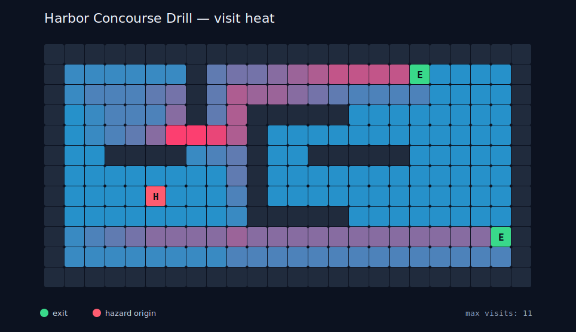

# Crowd Flow Lab

A deterministic multi-agent evacuation simulator written with the Python
standard library. Agents choose between exits using A* pathfinding, accumulated
traffic heat, live queue estimates, mobility limits, reaction delays, and a
spreading hazard field.



## Why this is more than a shortest-path demo

- Validates maps, exits, capacities, and non-overlapping spawn groups.
- Uses cost-aware A* routing around walls, congestion, and hazards.
- Replans when agents wait, so traffic can shift toward less crowded exits.
- Resolves cell conflicts deterministically while allowing queues to advance.
- Models per-exit throughput, different mobility rates, and reaction delays.
- Tracks P95 evacuation time, route replans, hazard exposure, exit utilization,
  queue history, and per-cell visit heat.
- Exports reproducible JSON, an analytical Markdown report, and an SVG heatmap.

## Run the included drill

Python 3.10 or newer is sufficient; there are no third-party dependencies.

```bash
python crowd_flow.py scenario.json --output-dir examples
```

## Run tests

```bash
python -m unittest discover -s tests -v
```

## Map markers

| Marker | Meaning |
|---|---|
| `#` | wall |
| `.` | traversable floor |
| `S` | spawn-compatible floor |
| `E` | configured exit |
| `H` | hazard origin |

The project was created with AI assistance as part of a transparent daily
creative-coding practice. Scenario data, deterministic seeds, tests, and full
generated outputs are included so results can be audited.
